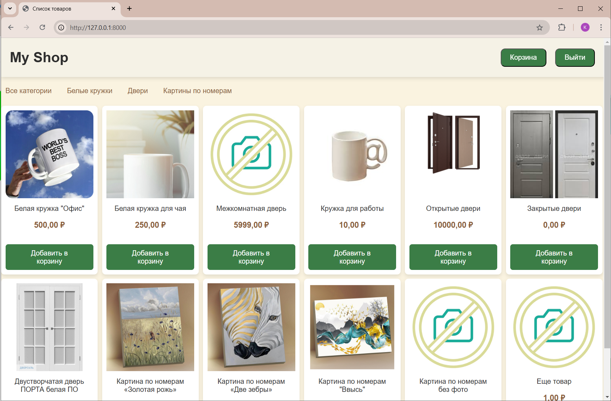
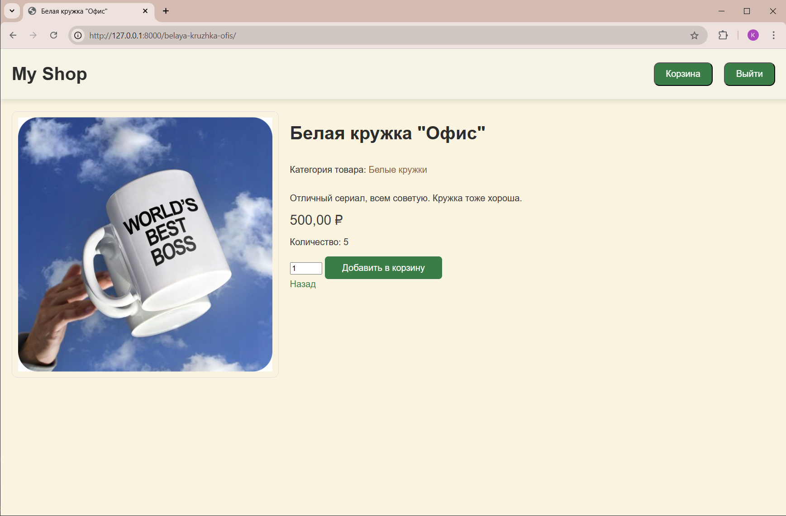
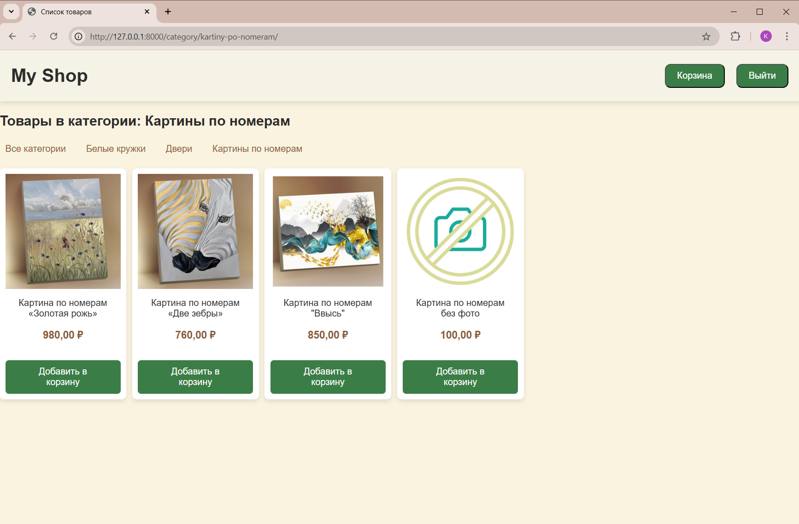
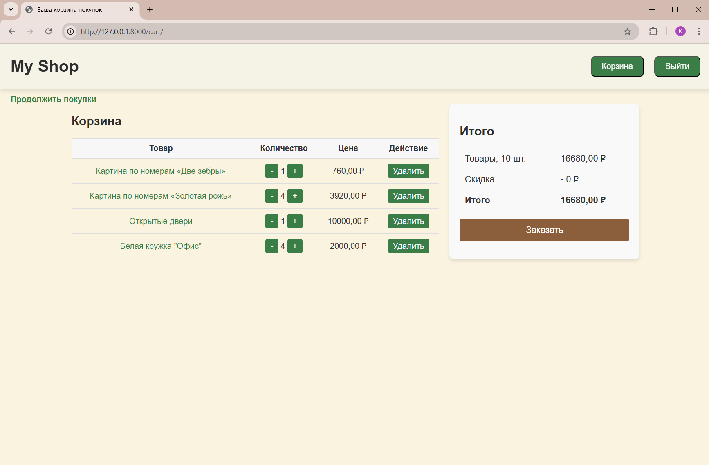
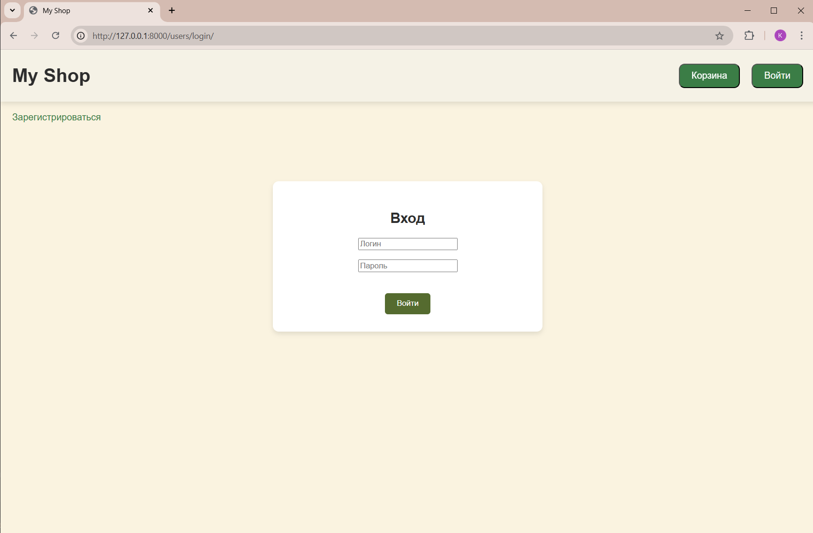

# django-shop
django-shop — это интернет-магазин, разработанный на Django. Проект включает такие функции, как главная страница с товарами и возможность разделения их по категориям, корзина товаров, страницы входа и регистрации, а также интерактивные элементы и современные стили.

## Оглавление

- [Функциональность](#функциональность)
- [Установка](#установка)
- [Администрирование](#администрирование)
- [Использование](#использование)
- [Пример](#пример)
- [Технологии](#технологии)
- [Лицензия](#лицензия)

## Функциональность

Основные функции интернет-магазина:
1. **Корзина товаров**: возможность добавлять, удалять и изменять количество товаров, а также отображение общей стоимости корзины. Все данные сохраняются в сессии пользователя и обновляются при изменениях.
2. **Личный кабинет**: регистрация и авторизация пользователей, также выход из личного кабинета с интерактивными уведомлениями.
3. **Католог товаров**: отображение списка товаров, с возможностью фильтрации по категориям. Пользователи могут просматривать товары, добавлять их в корзину и переходить на страницу товара. Также присутствует меню для навигации по категориям товаров.
4. **Карточки товаров**: отображение информации о товаре, включая изображение, описание, цену и количество на складе.
5. **Администрирование**: улучшенное управление продуктами и категориями (редактирование их свойств, фильтрация и поиск, а также изменение доступности товаров).

## Установка

1. Клонируйте репозиторий:
   ```bash
   https://github.com/Ksenia909/django-shop.git
   
2. Перейдите в директорию проекта:
   ```bash
   cd django-shop
   
3. Установите виртуальное окружение:
   ```bash
   python3 -m venv env
   source env/bin/activate  # для Unix
   .\env\Scripts\activate   # для Windows
   
4. Установите зависимости:
   ```bash
   pip install -r requirements.txt

5. Выполните миграции:
   ```bash
   python .\myshop\manage.py migrate
   
6. Запустите сервер:
   ```bash
   python .\myshop\manage.py runserver

7. Откройте браузер и перейдите на http://127.0.0.1:8000/ для запуска приложения.

## Администрирование

Django включает встроенную административную панель, доступную по адресу http://127.0.0.1:8000/admin.

1. Создайте суперпользователя для доступа к админ-панели:
   ```bash
    python .\myshop\manage.py createsuperuser
   
2. Введите имя пользователя, email и пароль для суперпользователя.
3. Перейдите в админ-панель (http://127.0.0.1:8000/admin) и войдите, используя учетные данные суперпользователя.
4. Через административную панель вы сможете управлять товарами, категориями, пользователями и другими данными, связанными с интернет-магазином.

## Использование
- Перейдите на главную страницу, чтобы увидеть список товаров.
- Добавляйте товары в корзину и изменяйте их количество.
- Зарегистрируйтесь и войдите в личный кабинет.
- Используйте кнопки «Войти» и «Выйти» в шапке для управления сессией пользователя.

## Пример






## Технологии
Проект создан с использованием следующих технологий:

- Python и Django — для серверной части и функциональности интернет-магазина.
- HTML, CSS, JavaScript — для интерфейса и интерактивных элементов.
- SQLite — в качестве базы данных.

## Лицензия
Этот проект распространяется под лицензией MIT. Подробности в LICENSE.